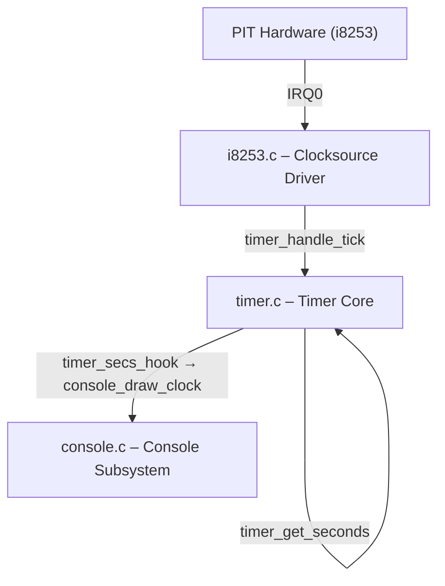

# Timer subsystem
- Core kernel subsystem that implements the system timer. Implemented over
clocksources such as devices/i8253.c

```mermaid
graph TD
    PIT["PIT Hardware (i8253)"]
    I8253["i8253.c – Clocksource Driver"]
    TIMER["timer.c – Timer Core"]
    CONSOLE["console.c – Console Subsystem"]

    PIT -->|IRQ0| I8253
    I8253 -->|timer_handle_tick| TIMER
    TIMER -->|timer_get_ticks| TIMER
    TIMER -->|timer_get_seconds| TIMER
    TIMER -->|timer_secs_hook → console_draw_clock| CONSOLE
```
